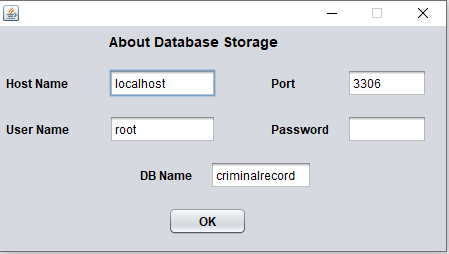
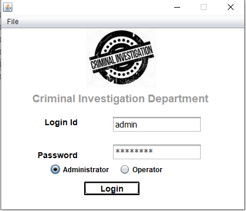
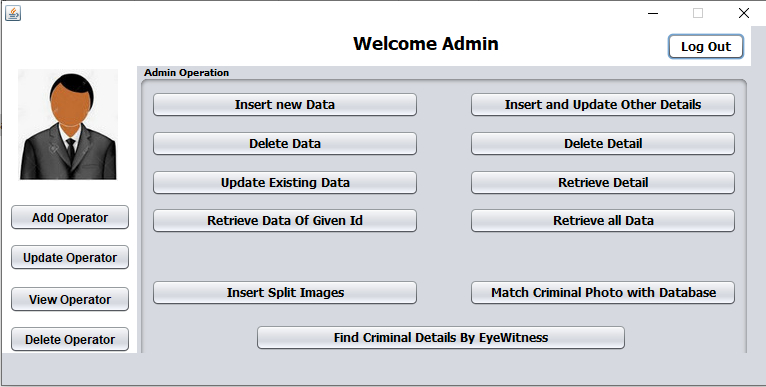
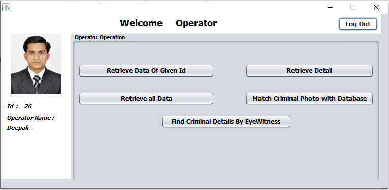

# Criminal Record Management System

Criminal record generally contains personal information about particular person along with photograph. To identify any Criminal we need some identification regarding person, which are given by eyewitness. In most cases the quality and resolution of the recorded image segments is poor and hard to identify a face. To overcome this sort of problem we are developing software. Identification can be done in many ways like finger print, eyes, DNA etc. One of the applications is face identification. The face is our primary focus of attention in social inters course playing a major role in conveying identify and emotion. Although the ability to infer intelligence or character from facial appearance is suspect, the human ability to recognize face is remarkable.

## ScreenShot







## Getting Started

These instructions will get you a copy of the project up and running on your local machine for development and testing purposes. See deployment for notes on how to deploy the project on a live system.


### Prerequisites

Windows/Linux
Java 8 or higher

### For execute Sample Preview

1. Download Sample_Preview.zip.
2. Extract it to any location.
2. execute CriminalDatabase.jar using cmd.
```
java -jar "CriminalDatabase.jar"
```


### Installing
1. Copy this repository.
2. Install XAMPP.
2. Start PHP MyAdmin.
3. Create A new DataBase criminalrecord.
4. Import sql file located at.
```
CriminalDatabase\Important_Stuff\Database Latest\criminalrecord.sql
```
5. Now open this project using netbeans ide.
6. Add JAR by right click on Library located at 
```
CriminalDatabase\Library
```
7. Run this project. 

## Authors

* **Praveen Kumar Sharma** - *Initial work* - [Praveen Kumar Sharma](https://github.com/Praveen101997)

See also the list of [contributors](https://github.com/your/project/contributors) who participated in this project.

## License
